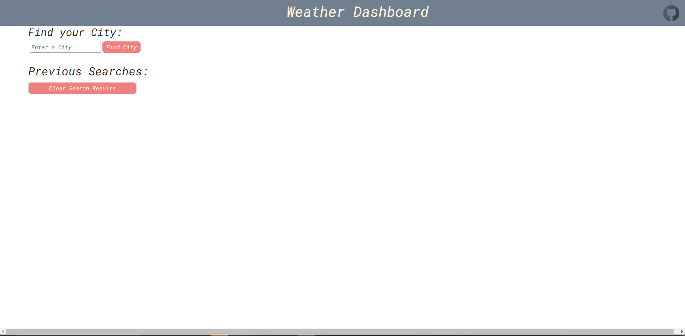
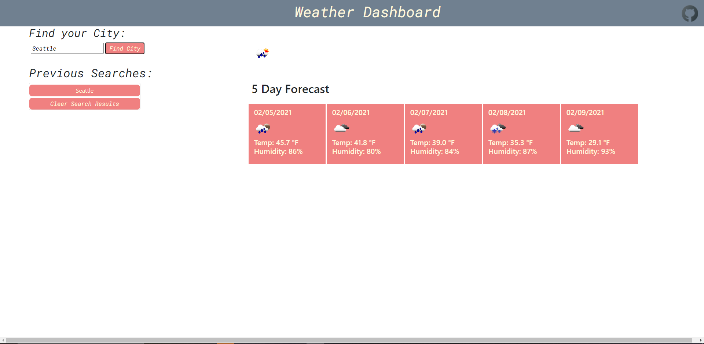
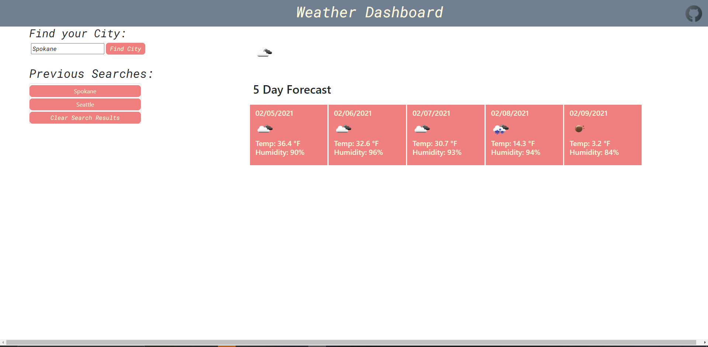

# weather.dashboard
Weather app dashboard where a user can pick various cities, see the current weather and the 5 day forecast for the selected city. The users previous searches will also be stored in local storage and displayed under previous searches to allow for users to access their previous city searches.

Here is the link to my deployed: https://codymichaud.github.io/weather.dashboard/

